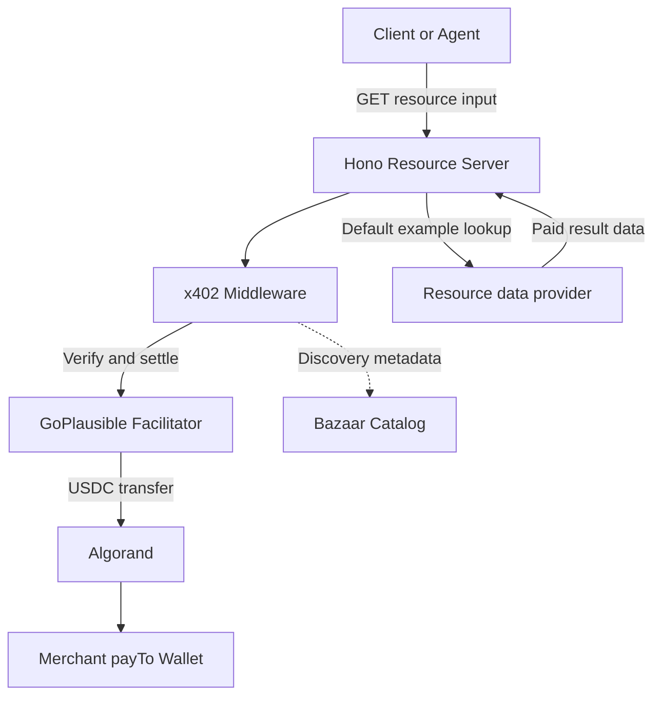
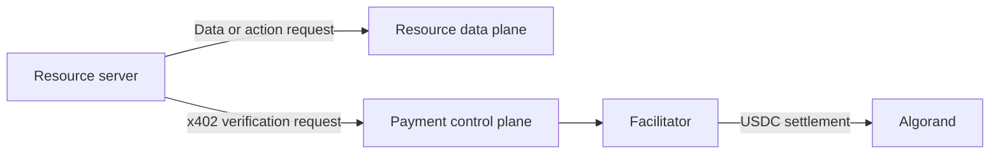

# x402 Commerce Template Architecture

TruthGuard keeps the paid HTTP concern separate from evidence retrieval. It sells one bounded claim-verification report.

## Components

### Client

The client asks for a paid response over normal HTTP. An unpaid client stops at the `402`. A paying client interprets the response, chooses a supported requirement, signs with its own wallet, and retries. x402 Commerce Template never receives the payer mnemonic.

### x402 Commerce Template Resource Server

Hono exposes public `GET /health` and protected `POST /api/v1/verify`. Claim/body validation happens before payment middleware. Once payment is verified, the handler calls the evidence-first verification engine.

### x402 Middleware

The middleware declares the exact scheme, USDC price, Algorand network, receiver, MIME type, description, and Bazaar extension. It constructs the `402`, verifies paid retries through the facilitator, and attaches the settlement response.

### GoPlausible Facilitator

The facilitator reports supported scheme/network pairs and handles verification and settlement. The resource server delegates these blockchain-facing operations; it does not hold the merchant key. Successful traffic also feeds GoPlausible's dashboard, Bazaar catalog, and Challenge leaderboard.

### Algorand Network

Algorand is the settlement rail for the USDC asset transfer. TestNet is safe demo infrastructure; MainNet settles real value and is required for current Challenge ranking.

### Resource Data Provider

TruthGuard queries Google Fact Check when configured and Wikidata for non-verdict context; optional Groq reasoning is constrained to retrieved evidence. Changing this resource logic does not change the payment protocol.

### Bazaar

Bazaar is discovery, not payment processing. x402 Commerce Template sends a machine-readable input description and output example as an x402 extension. A facilitator can index that metadata after observing a settled request.

### Merchant Wallet

`PAY_TO_ADDRESS` is the public Algorand account that receives USDC. It must be on the configured network and opted into that network's USDC ASA. The server never needs its mnemonic or private key.

## Two Uses of Algorand

The data request can fail even when payment infrastructure is healthy, and the facilitator can fail even when the Indexer is healthy. Keeping these paths visible makes demo debugging much easier.
