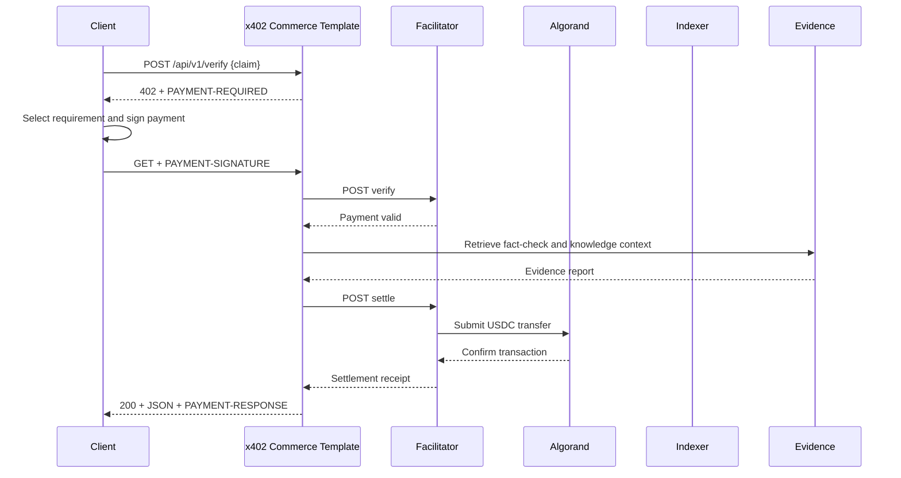

# The x402 Commerce Template x402 Flow

This is the real request lifecycle for TruthGuard's paid route, `POST /api/v1/verify`.

## 1. Unpaid Request

The client sends an ordinary HTTP `POST` with a valid claim. No wallet connection or API key is needed to ask what the resource costs.

## 2. HTTP 402 Response

The x402 middleware recognizes a protected route and returns `402 Payment Required`. The `PAYMENT-REQUIRED` header contains the protocol object encoded for HTTP transport.

## 3. Payment Requirements

x402 Commerce Template advertises the `exact` scheme, price, full Algorand network reference, USDC ASA ID, receiver address, description, and discovery metadata. The client decides whether it supports and accepts those terms.

## 4. Client Signs Payment

The x402 AVM client constructs an Algorand USDC transfer authorization and asks the payer wallet to sign it. In the browser, Pera signs locally; the server never receives a mnemonic.

## 5. Paid Request

The client repeats the same `GET` with `PAYMENT-SIGNATURE`. The server does not trust the header merely because it exists.

## 6. Facilitator Verification

x402 Commerce Template sends the payload and selected requirement to GoPlausible. The facilitator checks network, asset, amount, receiver, signature, timing, and transaction constraints.

## 7. Resource Execution

Only after verification does the Hono handler retrieve evidence and build the paid response. This prevents unpaid access to the resource work.

## 8. Settlement

The middleware asks GoPlausible to settle. The facilitator submits the authorized transaction group and waits for Algorand confirmation.

## 9. HTTP 200 Response

After successful settlement, the paid result is returned as JSON. Verification and settlement failures remain errors; x402 Commerce Template does not print a success claim based only on receiving some response.

## 10. Payment Receipt

`PAYMENT-RESPONSE` carries the settlement result, payer, network, and transaction ID. The paid and agent clients parse this header and print success only when its `success` field is true.
